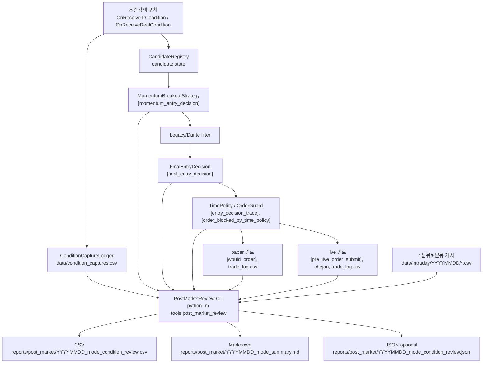

# PostMarketReview 운영/개발 가이드

이 문서는 장 마감 후 조건검색 포착 종목 전체를 복기하는 `PostMarketReview` 또는 `DailySignalReview` 기능을 운영, 구현, 검증하기 위한 가이드입니다.

대상 독자는 다음 세 부류입니다.

| 독자 | 읽는 목적 |
|---|---|
| 운영자 | 장 마감 후 오늘 조건식에 뜬 전체 종목, 매매 여부, 놓친 기회, 잘 막은 종목을 확인한다. |
| 개발자 | read-only 분석 도구를 기존 로그와 안전하게 연결하고 테스트한다. |
| 미래의 Codex/AI agent | 실제 주문 로직을 건드리지 않고 이 기능을 이어서 구현하거나 보수한다. |

## 1. 목적

`PostMarketReview`의 목적은 장중 조건검색에 포착된 모든 종목을 장 마감 후 데이터로 복기하는 것입니다. 기존 매매 복기는 `data/trade_log.csv`에 남은 매매 종목 중심으로 보기 쉽지만, 전략 개선에서 더 중요한 표본은 실제로 사지 않은 종목입니다.

이 기능은 다음 질문에 답해야 합니다.

| 질문 | 확인 위치 |
|---|---|
| 오늘 조건식에 총 몇 종목이 포착됐는가? | 조건 포착 CSV, Daily Summary |
| 그중 몇 종목을 매매했는가? | `data/trade_log.csv`, Trade Results |
| 몇 종목은 매매하지 않았는가? | Non-Traded Review |
| 매매하지 않은 이유는 무엇인가? | `final_reason`, `blocked_by`, `reason_code` |
| 안 샀지만 이후 크게 오른 종목은 무엇인가? | Missed Opportunities |
| 안 사서 잘한 종목은 무엇인가? | Good Rejects, Block Chase Review |
| 산 종목 중 손실/수익이 난 이유는 무엇인가? | Trade Results |
| 가장 많이 발생한 block reason은 무엇인가? | Reason Code Ranking |
| TimePolicy 때문에 놓친 종목이 있는가? | Time Policy Blocks |
| OrderGuard 때문에 차단된 종목이 있는가? | OrderGuard Blocks |
| DATA_QUALITY_BLOCK 종목이 실제로는 상승했는가? | Data Quality Blocks |
| BLOCK_CHASE로 막은 종목이 실제로 하락했는가? | Block Chase Review |
| WAIT_PULLBACK 종목 중 눌림 후 재상승한 종목이 있는가? | Non-Traded Review, Missed Opportunities |
| 조건식 포착 시간대별 성과는 어떤가? | Time Bucket Analysis |

이 도구는 감으로 파라미터를 바꾸기 위한 도구가 아닙니다. `BLOCK_CHASE`, `WAIT_PULLBACK`, `TimePolicy`, `OrderGuard`, 데이터 missing 차단이 실제로 어떤 결과를 만들었는지 사람이 판단할 수 있게 만드는 리포트입니다.

## 2. 전체 데이터 흐름

장중 주문 경로와 장 마감 후 분석 경로는 분리해야 합니다.



## 16. 리포트 스키마 보강 원칙

이 섹션은 `review/post_market.py`의 CSV/JSON/Markdown 출력 규칙을 고정합니다.

현재 구현 반영 상태:

- `condition_captures.csv`의 `candidate_id`, `strategy_name`은 구현됨.
- `candidate_registered`, `candidate_expired`, `candidate_recreated_after_ttl` 표준 로그는 구현됨.
- Markdown의 `Block Chase Review`, `Data Quality Blocks`, `Time Policy Blocks`, `OrderGuard Blocks` 독립 섹션은 구현됨.
- CSV의 `entry_time`, `exit_time`, `strategy_name`, `decision_trace`는 구현됨.
- JSON의 구조적 `decision_trace` 보존은 구현됨.
- reason별 MFE/MAE missing 제외 규칙은 테스트로 고정됨.

### CSV 추가 필드

| 컬럼 | 의미 | missing 처리 |
|---|---|---|
| `entry_time` | paper/live buy fill 시간 | 값이 없으면 빈 값. `0`, `00:00:00` 금지 |
| `exit_time` | paper/live sell fill 시간 | 미청산이면 빈 값. `0`, `00:00:00` 금지 |
| `strategy_name` | 조건 포착/전략 이름 | 없으면 `signal_source` fallback 가능. 이 경우 `data_quality`에 `strategy_name_fallback_used` 표시 |
| `decision_trace` | 최종 판단 trace | CSV에서는 compact JSON 문자열 |
| `join_quality` | 로그 join 품질 | `exact_candidate_id`, `fallback_symbol_time`, `fallback_symbol_only`, `partial_match`, `missing_join` |
| `data_quality` | 분석 데이터 품질 | 정상은 `ok`, 일부 누락은 `partial_data;...` |
| `review_category` | 최종 복기 분류 | 예: `TRADED_WIN`, `MISSED_OPPORTUNITY`, `DATA_QUALITY_BLOCK` |

### JSON decision_trace 보존

JSON 리포트에서는 `decision_trace`를 문자열로 저장하지 않습니다. 원본 `dict`/`list` 구조를 가능한 한 유지합니다.

예:

```json
{
  "symbol": "005930",
  "decision_trace": {
    "momentum_decision": "BLOCK_CHASE",
    "legacy_decision": "READY",
    "time_policy_decision": "ALLOW_ENTRY",
    "order_guard_decision": null,
    "final_reason": "block_chase_signal_candle_top",
    "strategy_version": "momentum_v1",
    "blocked_by": "momentum",
    "reason_code": "block_chase_signal_candle_top"
  }
}
```

### MFE/MAE missing 제외 규칙

고정 원칙:

> missing 값은 0이 아니다. missing MFE/MAE는 평균 계산에서 제외하고, 제외된 개수와 실제 계산 표본 수를 함께 표시한다.

Reason Code Ranking 계산 규칙:

| 값 | 의미 |
|---|---|
| `count` | 해당 `reason_code` 전체 row 수 |
| `avg_mfe_pct` | `mfe_pct`가 있는 row만 사용한 평균 |
| `avg_mae_pct` | `mae_pct`가 있는 row만 사용한 평균 |
| `n_mfe` | 평균 MFE 계산에 실제 사용한 표본 수 |
| `n_mae` | 평균 MAE 계산에 실제 사용한 표본 수 |
| `missing_mfe` | `mfe_pct`가 `None`/missing/NaN이라 제외된 row 수 |
| `missing_mae` | `mae_pct`가 `None`/missing/NaN이라 제외된 row 수 |

예:

| row | `mfe_pct` | `mae_pct` |
|---:|---:|---:|
| 1 | `0.02` | `-0.01` |
| 2 | `null` | `null` |
| 3 | `0.04` | `-0.02` |

결과:

| 값 | 결과 |
|---|---:|
| `count` | 3 |
| `avg_mfe_pct` | 0.03 |
| `avg_mae_pct` | -0.015 |
| `n_mfe` | 2 |
| `n_mae` | 2 |
| `missing_mfe` | 1 |
| `missing_mae` | 1 |

모든 MFE/MAE가 missing이면 평균은 `missing`/`null`, `n_mfe`/`n_mae`는 `0`으로 표시합니다.

### Markdown 섹션 해석

| 섹션 | 확인할 내용 |
|---|---|
| `Daily Summary` | 총 포착/매매/비매매 수와 주요 category 개수 |
| `Trade Results` | 실제 매매 종목의 진입/청산 시각, 가격, 수익률, 진입/청산 사유 |
| `Non-Traded Review` | 포착됐지만 매매하지 않은 전체 종목과 최종 차단 사유 |
| `Missed Opportunities` | 비매매 중 기준 MFE 이상 상승한 종목 |
| `Good Rejects` | 비매매 중 이후 의미 있는 상승이 없거나 하락한 종목 |
| `Block Chase Review` | 추격매수 차단이 좋은 차단이었는지, 놓친 기회였는지 |
| `Data Quality Blocks` | 데이터 missing/invalid 때문에 판단이 막힌 종목과 이후 MFE |
| `Time Policy Blocks` | 시간 필터로 막힌 종목의 이후 흐름 |
| `OrderGuard Blocks` | OrderGuard 리스크 제한으로 막힌 종목의 이후 흐름 |
| `Reason Code Ranking` | reason별 count, missing 제외 평균, n/missing 수 |
| `Time Bucket Analysis` | 시간대별 포착/매매/비매매/놓친 기회/평균 MFE/MAE |
| `Parameter Tuning Hints` | 자동 튜닝이 아니라 사람이 검토할 힌트 |
| `Next Action Checklist` | 장 마감 후 운영자가 확인할 체크리스트 |

튜닝 주의:

- `DATA_QUALITY_BLOCK` 중 MFE가 높으면 전략 파라미터보다 데이터 수집 안정성을 먼저 점검합니다.
- `BAD_BLOCK_CHASE`가 반복될 때만 chase distance, upper wick, pullback 기준을 검토합니다.
- `TIME_POLICY_BLOCK` 이후 상승이 반복되면 entry window를 검토합니다.
- 리포트 결과가 config를 자동 변경하면 안 됩니다. config 변경은 사람이 검토한 뒤 별도 커밋으로 진행합니다.

CLI 출력 파일명은 mode suffix를 사용합니다.

| mode | CSV | JSON | Markdown |
|---|---|---|---|
| `paper` | `YYYYMMDD_paper_condition_review.csv` | `YYYYMMDD_paper_condition_review.json` | `YYYYMMDD_paper_summary.md` |
| `live` | `YYYYMMDD_live_condition_review.csv` | `YYYYMMDD_live_condition_review.json` | `YYYYMMDD_live_summary.md` |
| `all` | paper/live 파일을 각각 생성 | paper/live JSON을 각각 생성 | paper/live Markdown을 각각 생성 |

`tools.post_market_review` CLI는 JSON 출력을 기본 생성합니다. JSON 생성을 생략해야 할 때만 `--no-json`을 사용합니다.

핵심 원칙:

| 원칙 | 설명 |
|---|---|
| 장 마감 후 실행 | 장중 주문 판단 루프와 별개로 CLI에서만 실행한다. |
| read-only | 기존 CSV/log/intraday 캐시를 읽고 `reports/post_market/`에만 쓴다. |
| 주문 API 금지 | `main.py`의 `send_order`, `dynamicCall("SendOrder...")`를 호출하지 않는다. |
| 전체 포착 종목 기준 | 매매한 종목뿐 아니라 매매하지 않은 종목도 반드시 행으로 남긴다. |
| mode 분리 | paper와 live 결과를 섞지 않는다. |
| missing 보존 | 데이터가 없으면 `missing`, 빈 CSV 셀, JSON `null`로 남긴다. 0으로 채우지 않는다. |

## 3. 레포에서 확인한 관련 파일

| 파일 | 역할 | 확인 내용 |
|---|---|---|
| `condition_capture_logger.py` | 조건검색 포착 CSV 기록 | `CONDITION_CAPTURE_CSV = data/condition_captures.csv`, `condition_detected`, `capture_price` 이벤트 기록 |
| `candidate_registry.py` | 조건 포착 후보 상태 관리 | `CandidateRegistry`, `Candidate`, `candidate_duplicate_refresh` 구조화 로그 확인 |
| `momentum_breakout_strategy.py` | 모멘텀 2차 판단 | `[momentum_entry_decision]` JSON 로그와 주요 지표 확인 |
| `final_entry_decision.py` | Momentum + Legacy/Dante 최종 진입 판단 | `FinalEntryDecision`, `decision_trace`, `trace_with_order_guard` 확인 |
| `time_policy.py` | 시간 정책 | `BLOCK_AFTER_ENTRY_CUTOFF`, `ALLOW_MANAGE_ONLY`, `FORCE_EXIT_WINDOW` 등 확인 |
| `order_guard.py` | 주문 전 안전 게이트 | `GuardDecision`, `[order_blocked_by_time_policy]` 확인 |
| `main.py` | Kiwoom 이벤트 루프와 주문 경로 | `[final_entry_decision]`, `[entry_decision_trace]`, `[would_order]`, `[pre_live_order_submit]`, `send_order`, `dynamicCall("SendOrder...")` 확인 |
| `training_recorder.py` | 거래/학습 CSV 기록 | `append_trade_log`, `data/trade_log.csv` 필드 확인 |
| `trade_config.py` | 전략/리스크 설정 | `TRADE_CONFIG`, `dry_run`, `live_trading_enabled`, `entry_windows`, `max_chase_distance_pct` 등 확인 |
| `momentum_replay.py` | 모멘텀 리플레이 | 사후 재생/검증 후보로 확인 |
| `review/structured_log.py` | 구조화 로그 파서 | `data/main.log*`에서 `[label] {json}` 패턴 읽음 |
| `review/post_market.py` | PostMarketReview 핵심 분석 | 후보/로그/체결/분봉 join, 카테고리 분류, CSV/MD/JSON 출력 |
| `tools/post_market_review.py` | CLI 엔트리포인트 | `python -m tools.post_market_review` 옵션 확인 |
| `test_post_market_review.py` | PostMarketReview 테스트 | 카테고리, missing, 출력 생성, 주문 API 미참조 테스트 확인 |
| `fetch_minute_bars.py` | 1분봉 캐시 수집 | `data/intraday/YYYYMMDD/<code>.csv` 생성 도구 확인 |
| `docs/README.md` | 기존 문서 인덱스 | docs 구조 확인 |

현재 별도의 `logs/` 디렉터리는 확인되지 않았습니다. 구조화 로그의 기본 위치는 `data/main.log`와 회전 파일 `data/main.log*`입니다.

## 4. 필요한 로그/데이터 소스

### A. 조건검색 포착 이벤트

기본 파일: `data/condition_captures.csv`

기록 모듈: `condition_capture_logger.py`

현재 확인된 필드:

| 필드 | 의미 | 상태 |
|---|---|---|
| `logged_at` | 로그 기록 시각 | 확인 |
| `event` | `condition_detected` 또는 `capture_price` | 확인 |
| `detected_at` | 조건 포착 시각 | 확인 |
| `captured_at` | capture 기록 시각 | 확인 |
| `captured_time` | `HHMMSS` | 확인 |
| `code` | 종목코드, 리포트의 `symbol` | 확인 |
| `name` | 종목명, 리포트의 `symbol_name` | 확인 |
| `condition_name` | 조건식명 | 확인 |
| `condition_formula` | 조건식 설명/수식 | 확인 |
| `condition_formula_version` | 조건식 버전 | 확인 |
| `condition_index` | Kiwoom 조건 인덱스 | 확인 |
| `event_type` | 조건 편입/이탈 이벤트 | 확인 |
| `screen_no` | 화면번호 | 확인 |
| `capture_price` | 포착 당시 또는 첫 실시간 현재가 | 확인 |
| `entry_trigger_price` | 눌림 기준 가격 | 확인 |
| `chejan_strength` | 체결강도 | 확인 |
| `accum_volume` | 누적 거래량 | 확인 |
| `signal_source` | 기본 `HTS_CONDITION_SEARCH` | 확인 |
| `source` | 기본 `kiwoom` | 확인 |
| `candidate_id` | CandidateRegistry와 join할 ID | 확인 필요: 현재 `CONDITION_CAPTURE_FIELDS`에는 없음 |
| `strategy_name` | 전략명 | 확인 필요: 현재 CSV 필드에는 없음. `signal_source`가 대체값으로 사용될 수 있음 |

운영 기준:

| event | 사용 방법 |
|---|---|
| `condition_detected` | 포착 종목 전체 모집단을 만든다. |
| `capture_price` | 포착가가 늦게 채워진 경우 같은 종목/조건/시간 근처의 후보에 붙인다. |

### B. CandidateRegistry 이벤트

기본 위치: `data/main.log*`

관련 모듈: `candidate_registry.py`

| 이벤트 | 현재 상태 | 주요 필드 |
|---|---|---|
| `candidate_duplicate_refresh` | 확인 | `symbol`, `candidate_id`, `first_detected_at`, `last_detected_at`, `first_capture_price`, `last_capture_price`, `refresh_count`, `duplicate_policy`, `reason`, `condition_name`, `strategy_name` |
| `candidate_registered` | 확인 필요 | `review/post_market.py` 파서는 label을 받을 준비가 있으나, 현재 `candidate_registry.py`에서 명시적 로그 방출은 확인되지 않음 |
| `candidate_expired` | 확인 필요 | 현재 `candidate_recreated_after_ttl` 로그는 확인됨. `candidate_expired` label 방출 여부는 확인 필요 |
| `candidate_recreated_after_ttl` | 확인 | 현재 파서 label 목록에 없음. 필요하면 parser 확장 후보 |

개발 권장:

| 항목 | 권장 |
|---|---|
| 신규 후보 등록 | `candidate_registered` 로그를 명시적으로 남기면 join 정확도가 오른다. |
| 만료 | `candidate_expired` 또는 `candidate_recreated_after_ttl` 중 하나로 표준화한다. |
| join key | 가능하면 `candidate_id`를 조건 포착 CSV와 모든 판단 로그에 같이 남긴다. |

### C. Momentum 판단 로그

기본 위치: `data/main.log*`

관련 모듈: `momentum_breakout_strategy.py`

구조화 label: `[momentum_entry_decision]`

확인된 주요 필드:

| 필드 | 의미 |
|---|---|
| `event` | `momentum_entry_decision` |
| `timestamp` | 판단 시각 |
| `symbol`, `symbol_name` | 종목코드/명 |
| `candidate_id` | 후보 ID |
| `condition_name` | 조건식명 |
| `strategy_name` | `TRADE_CONFIG.strategy_name` |
| `decision` | `BUY`, `WAIT_PULLBACK`, `WAIT_DATA`, `BLOCK_CHASE`, `REJECT` 등 |
| `reason_code` | 판단 사유 코드 |
| `reason_detail` | 사람이 읽는 사유 |
| `chase_risk_score` | 추격 위험 점수 |
| `volume_ratio` | 거래량 비율 |
| `turnover_speed_per_min` | 분당 거래대금 속도 |
| `trade_strength` | 체결강도 |
| `spread_rate` | 호가 스프레드 |
| `vwap` | 당일 VWAP |
| `current_price` | 판단 시점 현재가 |
| `capture_price` | 포착가 |
| `first_capture_price`, `last_capture_price` | 최초/최근 포착가 |
| `candidate_age_sec` | 후보 관찰 시간 |
| `high_distance_pct` | 직전 고점 대비 거리 |
| `prior_high` | 고점 기준값 |
| `upper_wick_ratio` | 윗꼬리 비율 |
| `pullback_pct` | 포착가 대비 눌림률 |
| `candle_cache_available` | 1분봉 캐시/최근 봉 사용 가능 여부 |
| `orderbook_available` | 호가 데이터 사용 가능 여부 |
| `market_data_available` | 필수 시장 데이터 사용 가능 여부 |
| `is_above_vwap` | VWAP 위 여부 |
| `one_min_reversal` | 1분봉 반전 확인 여부 |
| `recent_low_to_current_pct` | 최근 저점 대비 반등률 |
| `extension_from_vwap_pct` | VWAP 이격 |
| `extension_from_short_ma_pct` | 단기 평균 이격 |
| `entry_type` | `pullback`, `breakout_probe` 등 |
| `blocked_by` | 차단 주체/사유 |
| `time_decision_id` | TimePolicy 판단 ID |
| `time_policy_reason_code` | 시간 정책 사유 |

### D. FinalEntryDecision 로그

기본 위치: `data/main.log*`

관련 모듈: `main.py`, `final_entry_decision.py`

구조화 label: `[final_entry_decision]`

확인된 주요 필드:

| 필드 | 의미 |
|---|---|
| `event` | `final_entry_decision` |
| `timestamp` | 최종 판단 시각 |
| `symbol`, `symbol_name` | 종목코드/명 |
| `current_price` | 판단 시점 현재가 |
| `allowed` | 최종 진입 허용 여부 |
| `status` | `ready`, `wait`, `blocked` |
| `reason_code` | 최종 reason code |
| `final_reason` | 최종 사유 |
| `blocked_by` | `momentum`, `legacy_veto` 등 |
| `strategy_version` | 예: `momentum_v1_legacy_veto_v1` |
| `legacy_filter_enabled` | Legacy/Dante 필터 사용 여부 |
| `momentum_decision` | Momentum 판단 |
| `momentum_reason_code` | Momentum 사유 |
| `legacy_decision` | Legacy/Dante 판단 |
| `legacy_reason_code` | Legacy/Dante 사유 |
| `decision_trace` | Momentum, Legacy, OrderGuard까지 이어지는 판단 trace |

### E. TimePolicy / OrderGuard 로그

기본 위치: `data/main.log*`

관련 모듈: `time_policy.py`, `order_guard.py`, `main.py`

구조화 labels:

| label | 의미 |
|---|---|
| `[entry_decision_trace]` | FinalEntryDecision 이후 OrderGuard 판단 trace |
| `[order_blocked_by_time_policy]` | 주문 전 시간 정책 차단 |
| `[would_order]` | paper/dry-run 가상 주문 기록 |
| `[pre_live_order_submit]` | live 주문 직전 감사 로그. 실제 주문 호출 전까지만 기록 |

`entry_decision_trace` 확인 필드:

| 필드 | 의미 |
|---|---|
| `symbol`, `symbol_name` | 종목코드/명 |
| `side` | `buy` 또는 `sell` |
| `dry_run` | dry-run 여부 |
| `live_trading_enabled` | live 허용 여부 |
| `strategy_version` | 진입 전략 버전 |
| `legacy_filter_enabled` | Legacy/Dante 사용 여부 |
| `final_entry_allowed` | 최종 진입 판단 허용 여부 |
| `final_reason` | 최종 판단 사유 |
| `guard_allowed` | OrderGuard 허용 여부 |
| `guard_reason` | OrderGuard 사유 |
| `guard_decision_id` | Guard 판단 ID |
| `time_decision_id` | TimePolicy 판단 ID |
| `daily_buy_count` | 일일 매수 횟수 |
| `daily_loss` | 당일 손실 |
| `account_state_available` | 계좌 상태 사용 가능 여부 |
| `decision_trace` | Momentum, Legacy, OrderGuard 결합 trace |

`order_blocked_by_time_policy` 확인 필드:

| 필드 | 의미 |
|---|---|
| `symbol`, `side`, `rqname`, `mode` | 차단 대상 |
| `requested_amount` | 요청 금액 |
| `allowed`, `action`, `reason_code` | TimePolicy 판단 |
| `current_time`, `session`, `next_allowed_time` | 시간 상태 |
| `config_version`, `time_decision_id` | 정책 버전/ID |

### F. 주문/체결 로그

기본 파일: `data/trade_log.csv`

관련 모듈: `training_recorder.py`, `main.py`

현재 확인된 주요 필드:

| 필드 | 의미 |
|---|---|
| `logged_at` | 이벤트 시각 |
| `event` | `would_order`, `chejan`, 기타 매수/매도/취소 이벤트 |
| `condition_formula`, `condition_formula_version`, `condition_rules` | 조건식 메타 |
| `detected_at`, `signal_source` | 조건 포착 메타 |
| `code`, `name` | 종목 |
| `side` | `buy`, `sell` |
| `order_type`, `order_status`, `order_no`, `order_result` | 주문/체결 상태 |
| `quantity`, `order_price`, `current_price`, `executed_price`, `executed_quantity` | 가격/수량 |
| `entry_price`, `target_price` | 진입/목표가 |
| `score`, `expected_return` | 점수/기대수익 |
| `model_name`, `model_score`, `model_action`, `model_target`, `model_threshold` | 모델 메타 |
| `reason_code`, `reason`, `plan_source` | 진입/청산 사유 |
| `capture_price`, `pullback_pct`, `chejan_strength` | 포착/눌림/체결강도 |
| `hold_seconds`, `profit_rate`, `message` | 보유시간/손익률/메시지 |
| `market_regime`, `market_gate_action`, `market_gate_reason` | 시장 상태 메타 |

#### 조건식 조합 메타

`trade_log.csv`, `condition_captures.csv`, `dante_entry_training.csv`, `dante_shadow_training.csv`는 같은 조건식 조합 필드를 공유한다.

| 필드 | 의미 |
|---|---|
| `primary_condition_name` | 퀀트조건식 이름. 기본값 `단테떡상이_수정` |
| `bonus_condition_name` | 단테조건식 이름. 기본값 `단테떡상이` |
| `quant_detected` | 퀀트조건식 편입 여부 |
| `dante_detected` | 단테조건식 편입 여부 |
| `condition_combo` | `QUANT_ONLY`, `QUANT_AND_DANTE`, `DANTE_ONLY`, 누락 시 `UNKNOWN` |
| `condition_score_bonus` | 단테조건식 동시 만족 시 강도 가점 |
| `first_condition_name`, `last_condition_name` | 처음/마지막으로 편입된 조건식 |
| `first_condition_detected_at`, `bonus_condition_detected_at` | 조건식 편입 시각 |
| `time_between_conditions_sec` | 두 조건식 편입 간격 |

`daily_review_YYYY-MM-DD.md`의 **조건식 조합별 성과** 표는 다음 질문을 답하기 위한 표다.

- `QUANT_ONLY`가 양수 기대값이면 퀀트조건식만으로도 후보 품질이 충분한지 본다.
- `QUANT_AND_DANTE`의 승률/평균 R이 `QUANT_ONLY`보다 높으면 단테조건식은 매수 신호가 아니라 강도 가점으로 유효하다.
- `DANTE_ONLY`는 live 매수 금지, analysis/shadow 전용이다. trade_review에 `dante_only_buy_warning=true`가 보이면 주문 차단 경로를 즉시 점검한다.
- `disable_breakout_probe_live` 후보가 나오면 `BREAKOUT_SMALL` 계열이 `BUY_PULLBACK_RECLAIM`보다 부진하다는 뜻이므로 돌파 소량 live 차단을 유지한다.

mode별 해석:

| mode | 매매 판단 기준 |
|---|---|
| `paper` | `event == would_order`를 사용한다. buy/sell 가상 체결을 매칭한다. |
| `live` | `event == chejan`을 사용한다. 실제 체결 이벤트만 매칭한다. |
| `all` | CLI가 `paper`, `live`를 각각 별도 리포트로 만든다. 결과를 한 파일에서 섞지 않는다. |

### G. 장중 가격 데이터

기본 경로: `data/intraday/YYYYMMDD/<symbol>.csv`

관련 모듈: `fetch_minute_bars.py`, `review/post_market.py`

필수 컬럼:

| 필드 | 의미 |
|---|---|
| `datetime` 또는 `at` 또는 `timestamp` | 봉 시각 |
| `open` | 시가 |
| `high` | 고가 |
| `low` | 저가 |
| `close` | 종가 |
| `volume` | 거래량 |

지원 timeframe:

| 옵션 | 동작 |
|---|---|
| `--timeframe 1m` | 파일의 1분봉을 그대로 사용 |
| `--timeframe 5m` | 1분봉을 5분봉으로 집계해 사용 |

데이터가 없으면 `missing_intraday_bars`, 포착 이후 봉이 없으면 `missing_bars_after_signal`로 기록합니다.

## 5. 리포트 카테고리 정의

카테고리는 각 포착 후보를 하나의 운영 해석으로 묶기 위한 값입니다. 서로 겹칠 수 있는 원인이 있어도 리포트에는 하나의 `review_category`를 남깁니다.

| 카테고리 | 정의 | 분류 기준 | 예시 | 튜닝 해석 |
|---|---|---|---|---|
| `TRADED_WIN` | 실제 매매했고 수익으로 끝난 종목 | `traded=True`이고 `realized_pnl_pct > 0`. 손익률이 없으면 entry/close로 보조 판단 | paper buy 후 +2% 익절 | 수익 종목의 공통 reason과 시간대를 유지 후보로 본다. |
| `TRADED_LOSS` | 실제 매매했고 손실로 끝난 종목 | `traded=True`이고 수익 판단이 양수가 아님 | buy 후 -1.5% 손절 | 특정 `reason_code`에 손실이 몰리면 그 진입 유형을 보수적으로 검토한다. |
| `GOOD_REJECT` | 매매하지 않았고 이후 하락하거나 의미 있는 상승이 없었던 종목 | 비매매, missed threshold 미만, 별도 차단 특수 카테고리에 해당하지 않음 | weak_volume_ratio 차단 후 MFE +0.3% | 차단 로직이 작동한 표본. 유지 후보. |
| `MISSED_OPPORTUNITY` | 매매하지 않았지만 이후 기준 이상 상승한 종목 | 비매매, `mfe_pct >= --min-missed-opportunity-pct` | 거래량 missing으로 대기했지만 이후 +4% 상승 | 놓친 기회. 원인이 데이터인지 정책인지 전략인지 분해해야 한다. |
| `GOOD_BLOCK_CHASE` | 추격매수 차단 후 실제로 고점권에서 밀린 종목 | `reason_code`에 `block_chase` 또는 `block_` 계열, MFE가 threshold 미만 | 고점 이격 차단 후 종가 약세 | 추격 차단 유지 근거. |
| `BAD_BLOCK_CHASE` | 추격매수 차단했지만 이후 크게 상승한 종목 | `block_chase` 계열이고 MFE가 threshold 이상 | BLOCK_CHASE 후 +5% 돌파 | `max_chase_distance_pct`, 윗꼬리, VWAP 이격 기준을 재검토한다. 자동 변경 금지. |
| `WAIT_PULLBACK_NO_ENTRY` | 눌림 대기였지만 진입되지 않은 종목 | `reason_code` 또는 최종 상태가 `wait_pullback` 계열이고 비매매 | WAIT_PULLBACK 후 다시 상승 | 눌림 재진입/재평가 로직 개선 후보. |
| `DATA_QUALITY_BLOCK` | 데이터 missing 또는 invalid 때문에 차단된 종목 | `missing`, `invalid`, `market_data_unavailable`, `missing_candle_cache`, `missing_capture_price`, intraday missing 등 | `missing_volume_ratio` 차단 | 전략 튜닝보다 데이터 수집 안정성을 먼저 점검한다. |
| `TIME_POLICY_BLOCK` | 시간 필터 때문에 차단된 종목 | `blocked_by=time_policy` 또는 `BLOCK_AFTER_ENTRY_CUTOFF`, `BLOCK_PRE_OPEN`, `FORCE_EXIT_WINDOW`, `ALLOW_MANAGE_ONLY` 등 | 14:20 이후 신규 진입 차단 | 반복적으로 상승하면 entry window를 사람이 검토한다. |
| `ORDER_GUARD_BLOCK` | OrderGuard 때문에 차단된 종목 | `guard_reason` 존재 또는 `daily_buy_limit`, `daily_loss_limit`, `position_limit`, `reentry_cooldown`, `final_entry_decision` 등 | 일일 매수 제한으로 차단 | 리스크 제한의 효과를 검토한다. 손실 방지 표본도 같이 본다. |

현재 `review/post_market.py`의 분류 우선순위는 대략 다음과 같습니다.

1. 매매 종목이면 `TRADED_WIN`/`TRADED_LOSS`
2. 데이터 품질 차단이면 `DATA_QUALITY_BLOCK`
3. 시간 정책 차단이면 `TIME_POLICY_BLOCK`
4. OrderGuard 차단이면 `ORDER_GUARD_BLOCK`
5. 추격 차단이면 `GOOD_BLOCK_CHASE`/`BAD_BLOCK_CHASE`
6. 눌림 대기이면 `WAIT_PULLBACK_NO_ENTRY`
7. 기준 이상 상승이면 `MISSED_OPPORTUNITY`
8. 나머지는 `GOOD_REJECT`

분류 우선순위는 운영 해석에 영향을 줍니다. 예를 들어 데이터 missing이면서 MFE가 높았던 종목은 `MISSED_OPPORTUNITY`보다 `DATA_QUALITY_BLOCK`으로 먼저 잡히며, 이는 "매수 기준 완화"가 아니라 "데이터 수집 점검"으로 해석해야 합니다.

## 6. 핵심 지표 정의

모든 수익률은 비율 값입니다. 예를 들어 `0.02`는 +2%, `-0.015`는 -1.5%입니다.

| 지표 | 의미 | 계산 방식 | missing 처리 | 해석 |
|---|---|---|---|---|
| `MFE` / `mfe_pct` | 포착 후 최대 유리 변동 | `high_after_signal / capture_price - 1` | 포착가 또는 분봉 없으면 missing | 안 샀는데 얼마나 갈 수 있었는지 본다. |
| `MAE` / `mae_pct` | 포착 후 최대 불리 변동 | `low_after_signal / capture_price - 1` | 포착가 또는 분봉 없으면 missing | 차단 후 얼마나 위험했는지 본다. |
| `return_after_5m` | 포착 5분 후 수익률 | 5분 이후 첫 봉 close / capture - 1 | 해당 시점 봉 없으면 missing | 초기 추세 지속성 확인 |
| `return_after_10m` | 포착 10분 후 수익률 | 10분 이후 첫 봉 close / capture - 1 | 해당 시점 봉 없으면 missing | 단기 follow-through 확인 |
| `return_after_30m` | 포착 30분 후 수익률 | 30분 이후 첫 봉 close / capture - 1 | 해당 시점 봉 없으면 missing | 오전/오후 중기 흐름 확인 |
| `return_after_60m` | 포착 60분 후 수익률 | 60분 이후 첫 봉 close / capture - 1 | 해당 시점 봉 없으면 missing | 놓친 기회의 지속성 확인 |
| `return_to_close_pct` | 포착가 대비 장 마감 또는 마지막 봉 수익률 | 마지막 사용 봉 close / capture - 1 | 분봉 없으면 missing | 단기 급등 후 밀렸는지 구분 |
| `time_to_high_min` | 포착 후 고점까지 걸린 시간 | 고점 봉 시각 - 포착 분 단위 | 분봉 없으면 missing | 빠른 추격인지 느린 상승인지 구분 |
| `time_to_low_min` | 포착 후 저점까지 걸린 시간 | 저점 봉 시각 - 포착 분 단위 | 분봉 없으면 missing | 차단 직후 위험도 확인 |
| `realized_pnl_pct` | 실제 또는 paper 체결 기준 실현 손익률 | `profit_rate` 우선, 없으면 exit/entry - 1 | 청산가 없으면 missing | 산 종목의 실제 결과 |
| `chase_risk_score` | 추격 위험 점수 | `MomentumBreakoutStrategy`가 기록 | 로그 없으면 missing | 높고 성과가 나쁘면 차단 유지 근거 |
| `volume_ratio` | 기준 대비 거래량 비율 | Momentum 로그의 `volume_ratio` | missing이면 missing | 거래량 필터 적정성 검토 |
| `turnover_speed_per_min` | 분당 거래대금 속도 | Momentum 로그의 `turnover_speed_per_min` | missing이면 missing | 유동성/속도 필터 검토 |
| `trade_strength` | 체결강도 | Momentum 로그의 `trade_strength` | missing이면 missing | 100% 이상 조건의 영향 확인 |
| `spread_rate` | 호가 스프레드 비율 | Momentum 로그의 `spread_rate` | missing이면 missing | 진입 비용과 체결 위험 확인 |
| `high_distance_pct` | 최근 고점 대비 거리 | Momentum 로그의 `high_distance_pct` | missing이면 missing | `BLOCK_CHASE` 근거 확인 |
| `upper_wick_ratio` | 신호봉 윗꼬리 비율 | Momentum 로그의 `upper_wick_ratio` | missing이면 missing | 고점 매수 위험 확인 |

missing을 0으로 채우면 안 되는 이유:

| 잘못된 0 처리 | 생기는 문제 |
|---|---|
| `mfe_pct=0` | 실제 데이터가 없었는데 "상승이 없었다"고 오판한다. |
| `volume_ratio=0` | 데이터 missing과 실제 거래량 부족을 구분하지 못한다. |
| `realized_pnl_pct=0` | 미청산/미체결과 본전 청산이 섞인다. |
| `time_to_high_min=0` | 고점이 즉시 나왔다고 잘못 해석한다. |

권장 표기:

| 출력 | missing 표기 |
|---|---|
| CSV | 빈 셀 |
| JSON | `null` |
| Markdown | `missing` |
| data_quality | `missing_intraday_bars`, `market_data_unavailable`처럼 원인을 문자열로 남김 |

## 7. CSV/JSON/Markdown 출력 구조

기본 출력 디렉터리: `reports/post_market/`

현재 CLI 출력 파일명은 mode를 포함합니다. paper/live를 섞지 않기 위해 이 구조를 표준으로 권장합니다.

| 파일 | 목적 |
|---|---|
| `reports/post_market/YYYYMMDD_paper_condition_review.csv` | paper 기준 후보별 상세 테이블 |
| `reports/post_market/YYYYMMDD_paper_condition_review.json` | paper 기준 상세 JSON, `--json` 지정 시 생성 |
| `reports/post_market/YYYYMMDD_paper_summary.md` | paper 기준 운영 요약 |
| `reports/post_market/YYYYMMDD_live_condition_review.csv` | live 기준 후보별 상세 테이블 |
| `reports/post_market/YYYYMMDD_live_condition_review.json` | live 기준 상세 JSON, `--json` 지정 시 생성 |
| `reports/post_market/YYYYMMDD_live_summary.md` | live 기준 운영 요약 |

요청 예시의 `YYYYMMDD_condition_review.csv`처럼 mode가 없는 파일명은 확인 필요입니다. 운영 안전상 mode suffix를 붙이는 편이 낫습니다.

### CSV 필수 컬럼

현재 `review/post_market.py`의 `REVIEW_COLUMNS` 기준:

| 컬럼 | 의미 |
|---|---|
| `mode` | `paper` 또는 `live` |
| `symbol` | 종목코드 |
| `symbol_name` | 종목명 |
| `condition_name` | 조건식명 |
| `candidate_id` | 후보 ID. 없으면 빈 셀 |
| `detected_at` | 포착 시각 |
| `capture_price` | 포착가 |
| `traded` | 매매 여부 |
| `final_decision` | 최종 또는 Momentum 판단 |
| `final_reason` | 최종 판단 사유 |
| `blocked_by` | 차단 주체 |
| `reason_code` | 대표 reason code |
| `entry_price` | 진입가 |
| `exit_price` | 청산가 |
| `realized_pnl` | 실현 손익 금액 |
| `realized_pnl_pct` | 실현 손익률 |
| `close_price` | 포착 이후 마지막 봉 종가 |
| `return_to_close_pct` | 포착가 대비 마지막 봉 수익률 |
| `high_after_signal` | 포착 이후 고가 |
| `low_after_signal` | 포착 이후 저가 |
| `mfe_pct` | 포착 이후 최대 유리 변동 |
| `mae_pct` | 포착 이후 최대 불리 변동 |
| `time_to_high_min` | 고점까지 분 |
| `time_to_low_min` | 저점까지 분 |
| `return_after_5m` | 5분 후 수익률 |
| `return_after_10m` | 10분 후 수익률 |
| `return_after_30m` | 30분 후 수익률 |
| `return_after_60m` | 60분 후 수익률 |
| `volume_ratio` | 거래량 비율 |
| `turnover_speed_per_min` | 분당 거래대금 속도 |
| `trade_strength` | 체결강도 |
| `spread_rate` | 스프레드 비율 |
| `vwap` | VWAP |
| `chase_risk_score` | 추격 위험 점수 |
| `high_distance_pct` | 고점 대비 거리 |
| `upper_wick_ratio` | 윗꼬리 비율 |
| `time_policy_reason` | 시간 정책 사유 |
| `order_guard_reason` | OrderGuard 사유 |
| `data_quality` | missing/invalid 데이터 플래그. 여러 개면 `;`로 연결 |
| `missed_opportunity` | 기준 이상 MFE 여부 |
| `review_category` | 최종 리뷰 카테고리 |

추가 권장 컬럼:

| 컬럼 | 상태 | 이유 |
|---|---|---|
| `strategy_name` | 확인 필요 | 조건식/전략별 분석에 필요 |
| `entry_time` | 확인 필요 | Trade Results에서 진입/청산 시각을 명확히 보려면 필요 |
| `exit_time` | 확인 필요 | 현재 `TradeSummary`에는 있으나 CSV 컬럼에는 없음 |
| `decision_trace` | 확인 필요 | JSON에는 확장 가능하나 CSV에는 너무 클 수 있음 |

### JSON 출력

JSON은 CSV와 같은 행을 배열로 저장합니다. 숫자 missing은 `null`로 남겨야 합니다.

예시:

```json
[
  {
    "mode": "paper",
    "symbol": "005930",
    "symbol_name": "삼성전자",
    "condition_name": "퀀트조건식",
    "candidate_id": null,
    "detected_at": "2026-05-13 09:10:00",
    "capture_price": 70000.0,
    "traded": false,
    "reason_code": "block_chase_distance",
    "mfe_pct": 0.012,
    "data_quality": "",
    "missed_opportunity": false,
    "review_category": "GOOD_BLOCK_CHASE"
  }
]
```

### Markdown 요약 리포트 구성

운영 표준 Markdown은 다음 섹션을 포함해야 합니다.

| 섹션 | 포함 내용 |
|---|---|
| `Daily Summary` | 총 포착 수, 매매 수, 비매매 수, 승률, 실현 손익, mode |
| `Trade Results` | 매매 종목별 결과, 수익/손실, 진입/청산 시간, 진입/청산 사유 |
| `Non-Traded Review` | 비매매 종목, 최종 차단 사유, 이후 흐름, 놓친 기회 여부 |
| `Missed Opportunities` | 안 샀지만 크게 오른 종목, 차단 사유, 사후 타당성 |
| `Good Rejects` | 안 사서 잘한 종목, 차단 사유, 이후 하락/무의미 흐름 |
| `Block Chase Review` | `GOOD_BLOCK_CHASE`, `BAD_BLOCK_CHASE` 비교 |
| `Data Quality Blocks` | missing/invalid로 막힌 종목과 이후 MFE |
| `Time Policy Blocks` | TimePolicy로 막힌 종목과 이후 흐름 |
| `OrderGuard Blocks` | OrderGuard로 막힌 종목과 리스크 상태 |
| `Reason Code Ranking` | reason별 빈도, 평균 MFE/MAE, missed rate |
| `Time Bucket Analysis` | 시간대별 포착 수, 매매 수, 놓친 기회 수 |
| `Parameter Tuning Hints` | 자동 변경이 아닌 사람이 검토할 힌트 |
| `Next Action Checklist` | 다음날 전에 확인할 항목 |

현재 `review/post_market.py`는 `Focus Reviews` 아래에 TimePolicy, BLOCK_CHASE, DATA_QUALITY를 묶어 출력합니다. 운영 표준처럼 별도 섹션으로 나누는 개선은 확인 필요입니다.

## 8. CLI 사용법

엔트리포인트:

```bash
python -m tools.post_market_review --date 2026-05-13 --mode paper
python -m tools.post_market_review --date 2026-05-13 --mode live
python -m tools.post_market_review --date 2026-05-13 --mode all --output reports/post_market --json
```

옵션:

| 옵션 | 기본값 | 설명 |
|---|---:|---|
| `--date YYYY-MM-DD` | 필수 | 리뷰 대상 날짜 |
| `--mode paper/live/all` | `paper` | paper와 live를 분리 분석. `all`은 두 리포트를 각각 생성 |
| `--output` | `reports/post_market` | 출력 디렉터리 |
| `--min-missed-opportunity-pct` | `0.05` | MFE가 이 값 이상이면 missed opportunity로 표시 |
| `--timeframe 1m/5m` | `1m` | 가격 흐름 계산 봉 주기 |
| `--include-non-traded` | flag | 호환용. 현재 비매매 종목은 항상 포함 |
| `--include-data-quality-blocks` | flag | 호환용. 현재 데이터 품질 차단도 항상 포함 |
| `--json` | false | JSON 상세 리포트도 생성 |
| `--condition-captures` | `data/condition_captures.csv` | 조건 포착 CSV 경로 |
| `--trade-log` | `data/trade_log.csv` | 거래 로그 경로 |
| `--main-log` | `data/main.log` | 구조화 로그 기준 경로. 회전 파일도 읽음 |
| `--intraday-dir` | `data/intraday` | 1분봉 캐시 루트 |

권장 실행 순서:

```bash
python fetch_minute_bars.py 2026-05-13 --source condition
python -m tools.post_market_review --date 2026-05-13 --mode paper --output reports/post_market --json
python -m tools.post_market_review --date 2026-05-13 --mode live --output reports/post_market --json
```

1분봉 수집 대상 선택:

| 명령 | 의미 |
|---|---|
| `python fetch_minute_bars.py 2026-05-13` | 기존 호환 동작. `data/trade_log.csv`의 매매 종목 중심 수집 |
| `python fetch_minute_bars.py 2026-05-13 --source condition` | `data/condition_captures.csv` 기준으로 조건 포착 종목 전체 수집 |
| `python fetch_minute_bars.py 2026-05-13 --source all` | 조건 포착 종목 전체 + trade log 종목을 합쳐 수집 |
| `python fetch_minute_bars.py 2026-05-13 --include-condition-captures` | `--source all`과 같은 호환용 단축 옵션 |
| `python fetch_minute_bars.py 2026-05-13 --codes 005930,000660` | 명시한 종목만 수집 |

PostMarketReview를 정확히 돌리려면 `--source condition` 또는 `--source all`을 먼저 실행하는 것을 권장합니다. 그렇지 않으면 매매하지 않은 포착 종목의 MFE/MAE가 `missing_intraday_bars`로 남을 수 있습니다.

## 9. 장 마감 후 운영 runbook

장 마감 후 운영자는 다음 순서로 확인합니다.

| 단계 | 작업 | 확인 기준 |
|---:|---|---|
| 1 | `data/condition_captures.csv` 존재 확인 | 오늘 날짜의 `condition_detected`, `capture_price`가 있는가 |
| 2 | `data/main.log*` 확인 | `[momentum_entry_decision]`, `[final_entry_decision]`, `[entry_decision_trace]`가 남았는가 |
| 3 | `data/trade_log.csv` 확인 | paper면 `would_order`, live면 `chejan`이 오늘 날짜로 있는가 |
| 4 | 1분봉 캐시 확인 | `data/intraday/YYYYMMDD/*.csv`가 포착 종목 수만큼 있는가. 없으면 missing으로 남김 |
| 5 | post-market review 실행 | mode별 CSV/Markdown/JSON 생성 |
| 6 | `Daily Summary` 확인 | 총 포착 수와 매매/비매매 수가 상식적인가 |
| 7 | `Missed Opportunities` 확인 | 안 샀는데 크게 오른 종목과 차단 사유를 확인 |
| 8 | `Good Rejects` 확인 | 안 사서 잘한 종목과 공통 reason을 확인 |
| 9 | `Block Chase Review` 확인 | `GOOD_BLOCK_CHASE`와 `BAD_BLOCK_CHASE` 비율 확인 |
| 10 | `Data Quality Blocks` 확인 | missing으로 막힌 종목의 MFE가 높았는지 확인 |
| 11 | `Time Policy Blocks` 확인 | 14:20 이후 등 시간 차단 후 상승 종목이 반복되는지 확인 |
| 12 | `OrderGuard Blocks` 확인 | 일일 매수 제한, 손실 제한, 재진입 제한이 과도했는지 확인 |
| 13 | `TRADED_LOSS` 확인 | 산 종목 중 손실 reason과 시장 상황 확인 |
| 14 | `Reason Code Ranking` 확인 | 가장 많이 발생한 block reason과 missed rate 확인 |
| 15 | 다음날 config 후보 정리 | 바로 변경하지 말고 paper/live 표본을 더 확인 |

운영 메모 양식:

```markdown
## 2026-05-13 PostMarketReview 메모

- 안 샀는데 크게 오른 종목:
- 안 사서 잘한 종목:
- 손실 매매:
- 수익 매매:
- 가장 많은 차단 사유:
- TimePolicy 재검토 후보:
- BLOCK_CHASE 재검토 후보:
- DATA_QUALITY 점검 후보:
- 다음날 바로 바꾸지 않을 것:
- 추가로 수집할 데이터:
```

## 10. 튜닝 해석 가이드

이 리포트는 자동 튜닝 도구가 아닙니다. 출력은 사람이 검토할 힌트입니다.

| 관찰 | 해석 | 다음 행동 |
|---|---|---|
| `BLOCK_CHASE` 종목 대부분이 하락 | 추격 차단이 손실 회피에 기여 | 기준 유지. 표본 계속 수집 |
| `BAD_BLOCK_CHASE`가 반복 | 고점 차단이 좋은 돌파를 놓칠 수 있음 | `max_chase_distance_pct`, `upper_wick_ratio`, VWAP 이격을 수동 검토 |
| `DATA_QUALITY_BLOCK`이 많음 | 전략 문제가 아니라 데이터 수집 문제일 가능성 | volume/VWAP/candle cache 수집 안정성 먼저 점검 |
| `DATA_QUALITY_BLOCK` 중 MFE가 높음 | missing 때문에 좋은 종목을 놓쳤을 수 있음 | 데이터 경로와 로그 필드 보강 |
| `TIME_POLICY_BLOCK` 이후 상승이 반복 | 진입 시간 창이 너무 좁을 수 있음 | `entry_windows`, `no_new_entry_after`를 사람 검토 |
| `WAIT_PULLBACK_NO_ENTRY` 후 재상승 많음 | 눌림 대기 후 재평가가 약할 수 있음 | pullback 재진입/돌파 probe 로직 검토 |
| `TRADED_LOSS`가 특정 reason에 몰림 | 해당 진입 유형의 손실 가능성 | 그 reason의 필터 강화 또는 paper 검증 |
| `GOOD_REJECT`가 특정 reason에 몰림 | 해당 차단 reason이 유효 | 유지 후보 |
| `ORDER_GUARD_BLOCK`이 놓친 기회로 반복 | 리스크 제한과 기회비용 충돌 | 일일 매수 횟수, 포지션 한도는 손실 회피 효과와 함께 검토 |

금지:

| 금지 행동 | 이유 |
|---|---|
| 리포트 결과로 config 자동 변경 | 과최적화 위험 |
| 하루 표본만 보고 기준 완화 | 노이즈 가능성 큼 |
| missing을 0으로 채워 평균 계산 | 잘못된 결론 유도 |
| paper/live 결과 합산 | 체결 현실성이 다름 |

## 11. 안전 원칙

`PostMarketReview`는 read-only 분석 도구입니다.

반드시 지킬 것:

| 원칙 | 설명 |
|---|---|
| 실제 주문 API 호출 금지 | `dynamicCall("SendOrder...")` 호출 금지 |
| `send_order` 호출 금지 | `main.py`의 주문 메서드 호출 금지 |
| 주문 경로 import 금지 | 분석 도구가 `main.Kiwoom` 인스턴스를 만들면 안 됨 |
| CLI 전용 | 장중 자동매매 루프에서 자동 실행하지 않음 |
| 입력은 read-only | `data/condition_captures.csv`, `data/main.log*`, `data/trade_log.csv`, `data/intraday/`는 읽기만 |
| 출력만 생성 | `reports/post_market/`에 CSV/Markdown/JSON만 생성 |
| 실패 격리 | 리포트 생성 실패가 다음날 자동매매 실행에 영향을 주면 안 됨 |
| mode 분리 | paper/live를 같은 손익 계산에 섞지 않음 |
| missing 보존 | 없는 데이터를 0으로 대체하지 않음 |
| 자동 튜닝 금지 | config 변경은 사람이 검토한 뒤 별도 커밋 |

개발자가 확인할 안전 테스트:

| 확인 | 방법 |
|---|---|
| 주문 함수 미참조 | `tools/post_market_review.py`, `review/post_market.py`에 `send_order`, `SendOrder`, `dynamicCall` 문자열이 없는지 검사 |
| Kiwoom 인스턴스 미생성 | CLI가 `main.py`를 import하지 않는지 확인 |
| 출력 경로 제한 | 기본 출력이 `reports/post_market/`인지 확인 |
| 입력 변경 없음 | 테스트 전후 `data/` 원본 파일 hash 또는 mtime 비교 |

## 12. 테스트 체크리스트

문서 기준 테스트는 `test_post_market_review.py`에 추가하거나 유지합니다.

| 번호 | 테스트 | 기대 결과 |
|---:|---|---|
| 1 | 조건식 포착됐지만 매매하지 않은 종목이 리포트에 포함되는가 | 비매매 후보도 CSV/JSON/Markdown에 포함 |
| 2 | 매매한 종목이 `TRADED_WIN` 또는 `TRADED_LOSS`로 분류되는가 | 실현 손익률 기준 분류 |
| 3 | 안 샀지만 이후 상승한 종목이 `MISSED_OPPORTUNITY`로 분류되는가 | MFE threshold 이상 |
| 4 | 안 샀고 이후 하락한 종목이 `GOOD_REJECT`로 분류되는가 | missed flag false |
| 5 | `BLOCK_CHASE` 후 하락한 종목이 `GOOD_BLOCK_CHASE`로 분류되는가 | MFE threshold 미만 |
| 6 | `BLOCK_CHASE` 후 상승한 종목이 `BAD_BLOCK_CHASE`로 분류되는가 | MFE threshold 이상 |
| 7 | missing volume 데이터는 `DATA_QUALITY_BLOCK`으로 분류되는가 | `missing_volume_ratio`, `market_data_unavailable` 반영 |
| 8 | TimePolicy 차단은 `TIME_POLICY_BLOCK`으로 분류되는가 | `BLOCK_AFTER_ENTRY_CUTOFF` 등 반영 |
| 9 | OrderGuard 차단은 `ORDER_GUARD_BLOCK`으로 분류되는가 | `daily_buy_limit`, `position_limit` 등 반영 |
| 10 | CSV와 Markdown 리포트가 생성되는가 | output dir에 파일 생성 |
| 11 | JSON 옵션 사용 시 JSON 리포트가 생성되는가 | `--json` 또는 write_json true |
| 12 | 실행 중 실제 주문 함수가 호출되지 않는가 | `send_order`, `dynamicCall("SendOrder")` 미참조 |
| 13 | 데이터가 없는 종목은 0이 아니라 None/null/missing으로 기록되는가 | CSV 빈 셀, JSON null, Markdown missing |
| 14 | paper/live 결과가 분리되는가 | `YYYYMMDD_paper_*`, `YYYYMMDD_live_*` 별도 생성 |
| 15 | 조건 포착만 있고 분봉 없는 종목이 누락되지 않는가 | `DATA_QUALITY_BLOCK`, `missing_intraday_bars` |

권장 테스트 명령:

```bash
python -m unittest test_post_market_review.py
python -m unittest test_post_market_review.py test_momentum_replay.py
```

## 13. 향후 구현 단계

다음 구현 프롬프트로 넘길 작업은 아래 순서가 안전합니다.

| 우선순위 | 작업 | 이유 |
|---:|---|---|
| - | 현재 계획된 후속 구현 항목 없음 | 운영 중 발견되는 이슈를 별도 작업으로 등록 |

## 14. 확인 필요 항목

| 항목 | 현재 상태 |
|---|---|
| `condition_captures.csv`의 `candidate_id` | 현재 `CONDITION_CAPTURE_FIELDS`에는 없음. 필요하면 추가 구현 |
| `condition_captures.csv`의 `strategy_name` | 현재 명시 필드는 없음. `signal_source`가 대체값으로 사용될 수 있음 |
| `candidate_registered` 로그 | 파서는 받을 준비가 있으나 실제 방출은 확인 필요 |
| `candidate_expired` 로그 | 실제 방출 확인 필요. 현재 `candidate_recreated_after_ttl`은 확인됨 |
| mode 없는 파일명 `YYYYMMDD_condition_review.csv` | 안전상 mode suffix 권장. alias 필요 여부 확인 |
| 전체 포착 종목 1분봉 수집 자동화 | `fetch_minute_bars.py --source condition/all`로 CLI 입력은 지원됨. 장 마감 자동 실행 여부는 확인 필요 |
| Markdown 섹션 완전 분리 | 현재 구현은 일부를 `Focus Reviews`에 묶음. 운영 표준에 맞춘 분리 필요 |
| live 미체결/취소/rejected order 상세 join | `trade_log.csv` 필드는 있으나 review 분류 반영 범위 확인 필요 |
| 실전 조건식명 표시 | `trade_config.py`의 콘솔 출력이 일부 인코딩 깨짐으로 보임. 실제 런타임 값 확인 필요 |

## 15. 구현 프롬프트에 포함할 핵심 문장

다음 단계에서 구현을 맡길 때는 아래 문장을 그대로 포함하는 것을 권장합니다.

```text
PostMarketReview는 장 마감 후 read-only CLI로만 동작해야 합니다.
main.Kiwoom을 import하거나 인스턴스화하지 말고,
send_order, dynamicCall("SendOrder"), submit_order_guarded를 호출하지 마세요.
입력은 data/condition_captures.csv, data/main.log*, data/trade_log.csv,
data/intraday/YYYYMMDD/*.csv를 읽기만 하고,
출력은 reports/post_market/ 아래 CSV/Markdown/JSON만 생성하세요.
missing 값은 0으로 채우지 말고 CSV 빈 셀, JSON null, Markdown missing으로 남기세요.
paper와 live는 반드시 분리 분석하고,
매매하지 않은 조건 포착 종목도 반드시 리포트에 포함하세요.
```
## Condition Combo And Leader Score

Daily review separates the candidate source and the turnover-leader quality.

| group | interpretation | operating question |
|---|---|---|
| `QUANT_ONLY` | `단테떡상이_수정` only | Is the primary quant condition good enough by itself? |
| `QUANT_AND_DANTE` | primary quant condition, then `단테떡상이` bonus strength | Does the Dante strength bonus improve win rate or average R? |
| `DANTE_ONLY` | `단테떡상이` only, analysis/shadow only | Should this remain blocked from live buy? |
| `leader_score >= 80` | strong turnover leader | Are early turnover leaders producing better pullback entries? |
| `60 <= leader_score < 80` | usable but weaker leader | Does this bucket need stricter VWAP/strength filters? |
| `leader_score < 60` | weak leader | Should live entries keep waiting or block? |

Use the condition_combo summary together with the leader_score bucket table to answer:

- 퀀트조건식만으로도 충분한가?
- 단테조건식이 붙은 후보의 승률이 더 좋은가?
- 단테조건식 단독 후보는 매수 금지로 유지해야 하는가?
- 첫 눌림 진입이 돌파 소량 진입보다 나은가?
