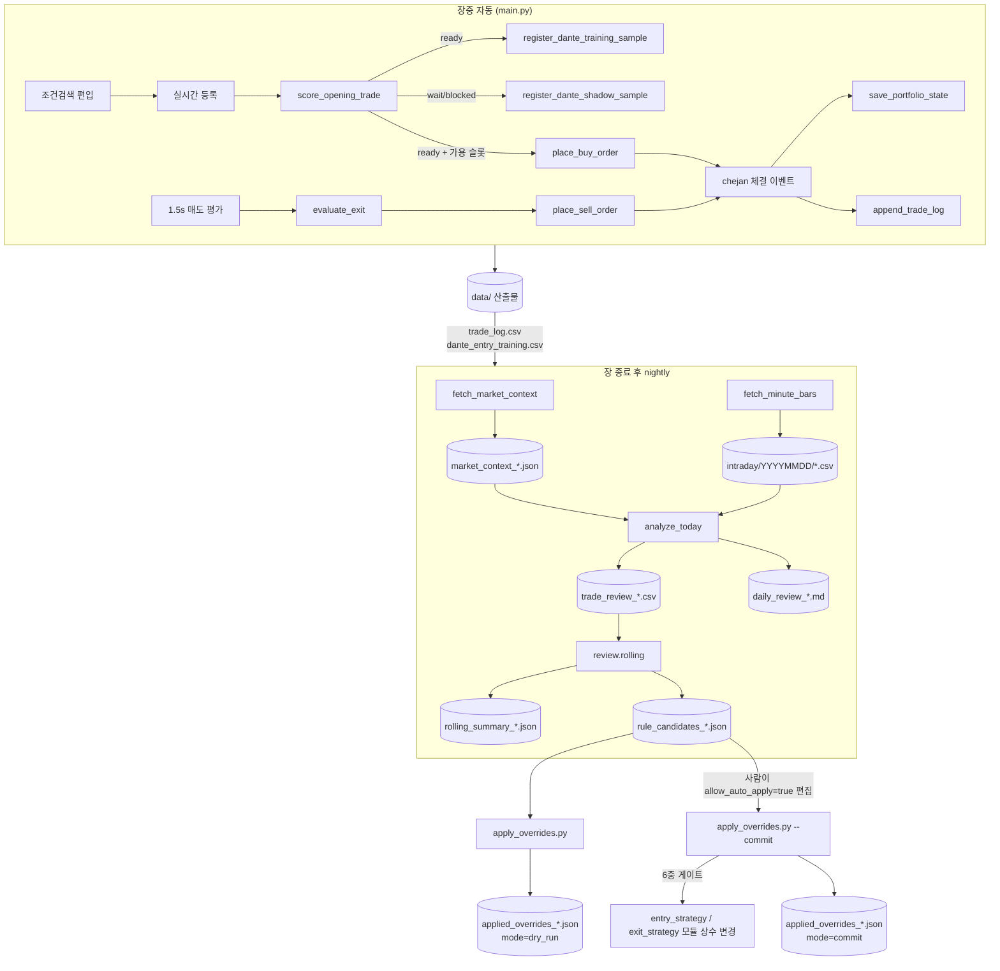

# 자동매매 프로그램 — 전체 개요

키움증권 OpenAPI 기반의 단테(Dante) 추세 추격형 자동매매 프로그램입니다.  
조건검색 편입 종목을 실시간으로 받아 1차/2차 분할매수 → R-multiple 트레일링 → 사후 라벨링 → 매일 리뷰/룰 후보 산출까지 한 사이클을 자동으로 돌립니다.

본 문서는 시스템 **전체 그림과 인덱스** 입니다. 세부 운영 절차/안전장치는 하위 문서를 참고하세요.


| 문서                                                             | 내용                                 |
| -------------------------------------------------------------- | ---------------------------------- |
| [review_system_overview.md](review_system_overview.md)         | 매일 리뷰/룰 자동 적용 시스템의 8단계 전체 흐름       |
| [review_user_guide.md](review_user_guide.md)                   | 운영자가 매일 따라 하는 7단계 명령어 가이드          |
| [review_safety_and_rollback.md](review_safety_and_rollback.md) | 6중 게이트, fixture 자동 rollback, 장애 대응 |


---

## 1. 한 줄 요약

**조건검색 편입 → 5분봉 BB/Envelope 추세 + 1분봉 눌림 진입 → R-multiple 손절/부분익절/트레일링 → 25분 사후 라벨링 → 매일 누적 통계로 룰 후보 제안.**

---

## 2. 폴더 구조

```
주식/
├─ main.py                       장중 자동매매 진입점 (PyQt5 + 키움 OpenAPI)
├─ logging_setup.py              공용 로깅 (RotatingFileHandler + stdout)
├─ fid_codes.py                  키움 FID ↔ 한글 이름 매핑
├─ training_recorder.py          학습/거래 로그 CSV 기록 (Mixin)
├─ entry_strategy.py             1차/2차 진입 평가 (순수 함수)
├─ exit_strategy.py              R-multiple 청산 평가 (순수 함수)
├─ scoring.py                    점수/피처 계산 (학습 + fallback 공용)
├─ portfolio.py                  Position dataclass + 디스크 영속화
├─ bars.py                       1분봉 집계기 + 5분봉 BB/Envelope 캐시
├─ ai_server.py                  FastAPI LightGBM 추론 서버 (현재 OFF)
├─ train_lgbm.py                 구학습 트랙 학습 스크립트 (entry_training)
├─ analyze_today.py              일별 거래 리뷰 + 매크로 join + 분류
├─ fetch_market_context.py       KOSPI/KOSDAQ 일봉 매크로 (nightly)
├─ fetch_minute_bars.py          매매 종목 1분봉 캐시 (nightly)
├─ apply_overrides.py            룰 후보 dry_run / commit CLI
├─ check_daily_realized.py       일별 실현손익 점검 (체결가 기반)
│
├─ review/                       리뷰/누적/분류/룰 후보 모듈
│   ├─ loader.py                 trade_log + dante_entry_training → Trade 객체
│   ├─ classifier.py             진입 4종 + 청산 4종 자동 분류 (v2)
│   ├─ metrics.py                R 배수, MFE/MAE, give-back 등 파생 지표
│   ├─ intraday.py               1분봉 캐시 → 정밀 D 피처
│   ├─ market_context.py         KOSPI/KOSDAQ 매크로 join + 강도 분류
│   ├─ rolling.py                5/10/20일 누적 통계 + 룰 후보 산출
│   ├─ rules.py                  룰 트리거 정의 (BE 컷, 빠른 익절 등)
│   ├─ overrides.py              dry_run / commit 적용기 (단일 진입점)
│   └─ policy_replay.py          정책 dry_run 비교 (BASE/CONSERVATIVE/...)
│
├─ docs/                         (본 폴더) 운영 문서
│   ├─ README.md                  ← 본 문서
│   ├─ review_system_overview.md  리뷰 시스템 전체 흐름
│   ├─ review_user_guide.md       운영자 매일 절차
│   └─ review_safety_and_rollback.md  안전장치 + 롤백
│
├─ data/                         실시간/일별 산출물 (gitignored)
│   ├─ main.log                   회전 로그 (5MB × 5)
│   ├─ trade_log.csv              매수/매도 이벤트 누적
│   ├─ dante_entry_training.csv   ready 진입 후보 + 25분 사후 라벨
│   ├─ dante_shadow_training.csv  wait/blocked 표본 + 25분 사후 라벨
│   ├─ portfolio_state.json       장중 크래시 복원용 atomic 저장
│   ├─ intraday/YYYYMMDD/*.csv    종목별 1분봉 캐시
│   └─ reviews/                   매크로/리뷰/누적/룰 후보 산출물
│
└─ tests/                        pytest 픽스처 (intraday/reviews)
```

---

## 3. 모듈별 책임

### 3.1 진입점/실시간 운용


| 파일                                      | 역할                                                                                                                     |
| --------------------------------------- | ---------------------------------------------------------------------------------------------------------------------- |
| [main.py](../main.py)                   | 키움 OpenAPI 이벤트 루프, 조건식 편입 처리, 1차/2차 매수 발주, 매도 평가, portfolio 영속화, 학습 표본 등록의 오케스트레이션 (PyQt5 `QAxWidget` + `Kiwoom` 클래스). |
| [logging_setup.py](../logging_setup.py) | `setup_logging()` — root logger 1회 초기화. `KIWOOM_LOG_LEVEL` 환경변수로 레벨 제어. `data/main.log` 5MB × 5개 회전.                   |
| [fid_codes.py](../fid_codes.py)         | `FID_CODES` dict (키움 FID 코드 ↔ 한글 이름) + `get_fid()` 역방향 lookup.                                                         |


### 3.2 전략 (순수 함수)


| 파일                                        | 역할                                                                                                       | 핵심 상수                                                                                                           |
| ----------------------------------------- | -------------------------------------------------------------------------------------------------------- | --------------------------------------------------------------------------------------------------------------- |
| [entry_strategy.py](../entry_strategy.py) | A급(0봉 돌파 추격) / B급(1봉 돌파+눌림) 분기, 게이트(체결강도/거래속도/스프레드/관찰시간/추세 필터/과열 차단).                                    | `DANTE_FIRST_ENTRY_RATIO=0.25` `DANTE_GRADE_B_RATIO=1.0` `MIN_CHEJAN_STRENGTH_HARD=120` `MAX_SPREAD_RATE=0.006` |
| [exit_strategy.py](../exit_strategy.py)   | -1R 손절 → +1R BE 이동 → +2R 50% 부분익절 → 잔량 추세이탈 → 25분 시간손절.                                                  | `R_UNIT_PCT=0.015` (1R) `EXIT_BE_R=1.0` `EXIT_PARTIAL_R=2.0` `EXIT_TIME_LIMIT_SECONDS=1500`                     |
| [scoring.py](../scoring.py)               | 진입 피처/점수, 호가단위 round_up, calibration, 단테 학습용 피처(`build_dante_entry_features`). main 과 ai_server 의 단일 출처. | `ENTRY_WEIGHT_*` `EXIT_WEIGHT_*` `_TICK_SIZE_TABLE`                                                             |


### 3.3 데이터 모델/캐시


| 파일                                              | 역할                                                                                                                                       |
| ----------------------------------------------- | ---------------------------------------------------------------------------------------------------------------------------------------- |
| [portfolio.py](../portfolio.py)                 | `Position` dataclass (`entry_stage`, `stop_price`, `breakout_grade`, `pending_sell_intent`...) + 디스크 영속화 (`save`/`load`). type-cast 강건성. |
| [bars.py](../bars.py)                           | `MinuteBarAggregator` (실시간 틱 → 1분봉) + `FiveMinIndicatorCache` (opt10080 → BB(45,2)/BB(55,2)/Envelope(13,2.5)/Envelope(22,2.5)).          |
| [training_recorder.py](../training_recorder.py) | `TrainingRecorderMixin` — Kiwoom 에 합쳐지는 mixin. 4개 트랙(구학습/dante/dante_shadow/trade_log) CSV 기록 분리. 같은 모듈 상수가 `main.X` 로도 re-export 됨.     |


### 3.4 학습/추론


| 파일                                | 역할                                                                                                                      |
| --------------------------------- | ----------------------------------------------------------------------------------------------------------------------- |
| [train_lgbm.py](../train_lgbm.py) | LightGBM 분류기 학습 (`entry_training.csv` → `models/opening_lgbm.pkl`). 5-fold CV + threshold tuning. 64bit venv 에서 실행.     |
| [ai_server.py](../ai_server.py)   | FastAPI 서버. main.py 가 진입 시점에 HTTP POST 로 점수를 받음. 모델 미설치 시 fallback 점수 사용. **현재 `AI_SERVER_ENABLED=False`** (단테 룰 운용 중). |


### 3.5 야간 리뷰 파이프라인


| 파일                                                    | 역할                                                                       |
| ----------------------------------------------------- | ------------------------------------------------------------------------ |
| [fetch_market_context.py](../fetch_market_context.py) | KOSPI/KOSDAQ 일봉(opt20006) → `data/reviews/market_context_*.json`         |
| [fetch_minute_bars.py](../fetch_minute_bars.py)       | 오늘 매매한 종목의 1분봉(opt10080) → `data/intraday/YYYYMMDD/*.csv`                |
| [analyze_today.py](../analyze_today.py)               | 거래 묶기 + 분류 + 메트릭 + 매크로 join → `trade_review_*.csv` / `daily_review_*.md` |
| [check_daily_realized.py](../check_daily_realized.py) | 키움 잔고/체결 vs 로그 기반 손익률 차이 점검                                              |


### 3.6 review 패키지 (분류/누적/적용)


| 모듈                                                      | 역할                                                                                                                                                          |
| ------------------------------------------------------- | ----------------------------------------------------------------------------------------------------------------------------------------------------------- |
| [review/loader.py](../review/loader.py)                 | `trade_log.csv` + `dante_entry_training.csv` → `Trade` 객체 변환 + 사후 라벨 join                                                                                   |
| [review/classifier.py](../review/classifier.py)         | 진입 4종(`breakout_chase`/`first_pullback`/`late_chase`/`fake_breakout`) + 청산 4종(`good_stop`/`bad_stop`/`fast_take`/`late_take`/`clean_exit`) 자동 분류. v2 강화 로직. |
| [review/metrics.py](../review/metrics.py)               | R 배수, MFE, MAE, give-back, over-run, BE 위반 등 파생 지표                                                                                                          |
| [review/intraday.py](../review/intraday.py)             | 1분봉 캐시에서 진입 정밀 메트릭(VWAP 대비, 진입봉 윗꼬리 등) 추출                                                                                                                   |
| [review/market_context.py](../review/market_context.py) | KOSPI/KOSDAQ 매크로 JSON 로드/저장 + `strong/weak/neutral` 분류                                                                                                      |
| [review/rolling.py](../review/rolling.py)               | 5/10/20 영업일 누적 통계 + 룰 후보 산출 (v1/v2 분리 집계)                                                                                                                   |
| [review/rules.py](../review/rules.py)                   | 룰 트리거 정의(`break_even_cut`, `take_profit_faster`, `wait_for_pullback`, `block_fake_breakout`, `apply_trailing`)                                              |
| [review/overrides.py](../review/overrides.py)           | 적용기 단일 진입점. 6중 게이트 + fixture rollback. **유일하게 모듈 상수를 변경할 수 있는 경로.**                                                                                         |
| [review/policy_replay.py](../review/policy_replay.py)   | 진입 정책 dry_run 비교 (BASE/CONSERVATIVE_A/MICRO_A/PULLBACK_ONLY/LATENCY_GATED/HIGH_CHASE_BLOCKED)                                                               |


---

## 4. 데이터 흐름 한 장 그림




---

## 5. 단테 전략 핵심 룰 (한 화면 요약)

```
[조건검색]  영웅문 "단테떡상이"
            5분봉 BB(45,2) / BB(55,2) / Envelope(13,2.5) / Envelope(22,2.5)
            동시 상향돌파 + 일거래량 5만 + 체결강도 100%

[1차 진입 게이트]
  관찰 ≥ 30s, 실시간 틱 ≥ 5, 스프레드 ≤ 0.6%
  거래속도 ≥ 500주/s
  체결강도: Hard ≥ 120 통과 / Soft 100~120 + 추세 상승 시만 통과
  5분봉 추세 OK + 진행봉 윗꼬리 ≤ 40%
  과열: 시가 대비 ≤ +10% 그리고 BB55 대비 ≤ +4%

[A급 / B급 분기]
  A급 (0봉 돌파)        → 1차 추격 25%        → 본진입 75% (눌림)
  B급 (1봉 돌파만)      → 1차 추격 없음       → 첫 눌림에서 100% 일괄
  둘 다 아님            → wait

[2차 본진입 윈도우]  1차 체결 후 10분 안에 첫 눌림 발생
  눌림: 직전 고점 대비 -0.4% ~ -1.5% (-2% 초과 시 차단)
  음봉 1~2개 후 양봉 반전 + 체결강도 유지

[청산 (R-multiple, 1R = 1.5%)]
  1) -1R 손절 (전량)
  2) +1R 도달 → stop = entry (BE 보장)
  3) +2R 도달 + 미부분익절 → 50% 부분 익절
  4) 부분익절 후 잔량: 1분봉 5MA 이탈 / 체결강도 < 80 / 5분봉 Env(13) 이탈 → 청산
  5) 25분 + r < 1R → 시간 손절
  6) 15:15 강제 청산
```

---

## 6. 학습/검증 트랙 — 현재 단계

현재는 **데이터 누적 단계** 입니다. 학습된 모델을 운용에 반영하지 않고,
같은 룰을 흔들지 않고 충분한 표본을 모으는 데 집중합니다.


| 트랙                                  | 파일                               | 상태                                      | 표본 정의                                                                                             |
| ----------------------------------- | -------------------------------- | --------------------------------------- | ------------------------------------------------------------------------------------------------- |
| 구학습 (`entry_training`)              | `data/entry_training.csv`        | **OFF** (`TRAINING_DATA_ENABLED=False`) | 구 LightGBM 진입 후보 — 단테 전환 후 비활성                                                                    |
| 단테 ready (`dante_entry_training`)   | `data/dante_entry_training.csv`  | **ON**                                  | 게이트 `ready` 종목 + 25분 사후 라벨(`reached_1r`/`reached_2r`/`hit_stop`/`time_exit`). 60s cooldown        |
| 단테 shadow (`dante_shadow_training`) | `data/dante_shadow_training.csv` | **ON**                                  | 게이트 `wait`/`blocked` 종목 (전략 임계 미달만; 데이터 부족은 제외) + 같은 25분 라벨. 90s cooldown. **false-negative 측정용** |
| 거래 로그                               | `data/trade_log.csv`             | **ON**                                  | 모든 매수/매도 이벤트 + reason/profit_rate/hold_seconds                                                    |


**주의** — 표본이 적을 때 임계값을 자주 바꾸면 어떤 룰이 좋은지 흐려집니다.
일단 룰을 고정하고 누적한 뒤 `apply_overrides.py` 로 `dry_run` 검토부터
시작하세요.

---

## 7. 디스크 영속화 (장중 크래시 복원)

`data/portfolio_state.json` 에 매 체결/매도 큐 변경/매도 평가 사이클마다
atomic write. 잃으면 전략이 망가지는 8개 필드를 보호합니다.


| 필드                         | 잃으면 일어나는 일                   |
| -------------------------- | ---------------------------- |
| `entry_stage`              | 1차에 25%만 사놓고 2차 본진입 영원히 안 발사 |
| `planned_quantity`         | 2차 매수 수량 계산 깨짐               |
| `stop_price`               | BE 스탑 풀려 -1R 보호 사라짐 (가장 위험)  |
| `partial_taken`            | +2R 도달 시 또 부분익절 시도 (이중 체결)   |
| `breakout_high`            | 추적 고점이 0부터 다시 → 눌림 판정 오작동    |
| `breakout_grade`           | A/B 등급 식별자 손실 → 분할매수 분기 오작동  |
| `pullback_window_deadline` | 2차 본진입 윈도우 영원히 만료 안 됨        |
| `pending_sell_intent`      | 큐에 있던 매도 의도 사라짐 → 매도 재시도 중단  |


부팅 시 `load_portfolio_state()` 가 `update_account_status()` 보다 먼저
호출돼, 잔고 TR 응답이 *휘발성 필드만* 덮어쓰고 전략 필드는 디스크 본을
유지합니다. 손상된 JSON 은 `.corrupt` 접미사로 보존되고 빈 상태로 부팅 진행.

상세는 [review_safety_and_rollback.md §11](review_safety_and_rollback.md) 참고.

---

## 8. 실행 순서

```bash
# === 장중 (32-bit Python + 키움 OpenAPI) ===
.\.venv\Scripts\python.exe .\main.py

# === 장 종료 후 nightly (같은 32-bit 환경) ===
python .\fetch_market_context.py        # KOSPI/KOSDAQ 일봉 → market_context_*.json
python .\fetch_minute_bars.py           # 매매 종목 1분봉 캐시
python .\analyze_today.py               # trade_review/daily_review/rule_overrides
python -m review.rolling                # 5/10/20 누적 + rule_candidates

# === dry_run 검토 ===
python .\apply_overrides.py             # mode=dry_run, 모듈 상수 변경 없음

# === (사람이 JSON 편집해 allow_auto_apply=true) ===
# data/reviews/rule_candidates_YYYYMMDD.json 의 적용할 후보만 true 로

python .\apply_overrides.py --commit    # mode=commit, high+approved 만 적용

# === 표본이 충분히 쌓인 뒤, 64-bit venv 에서 학습 (선택) ===
.\venv64\Scripts\python.exe .\train_lgbm.py
.\venv64\Scripts\python.exe -m uvicorn ai_server:app --host 127.0.0.1 --port 8000
```

상세 옵션/체크리스트는 [review_user_guide.md](review_user_guide.md) 참고.

---

## 9. 테스트

```bash
.\.venv\Scripts\python.exe -m unittest discover -s . -p "test_*.py"
```

총 **249건**. PyQt5/pandas 미설치 환경(64bit/CI)에서도 `sys.modules` stub
으로 main 을 import 할 수 있게 작성되어 있습니다 (
[test_shadow_training.py](../test_shadow_training.py),
[test_save_portfolio_skip.py](../test_save_portfolio_skip.py) 참고).


| 카테고리      | 파일                                                            | 비고                                 |
| --------- | ------------------------------------------------------------- | ---------------------------------- |
| 진입 전략     | `test_entry_strategy.py`                                      | A급/B급 게이트, 눌림 윈도우                  |
| 청산 전략     | `test_exit_strategy.py`                                       | R-multiple 트레일링, 시간 손절             |
| 단테 피처     | `test_dante_features.py`                                      | scoring.build_dante_entry_features |
| 분류기       | `test_classifier.py`                                          | 진입 4종 + 청산 4종 (v2)                 |
| 1분봉       | `test_intraday.py`                                            | VWAP, 윗꼬리 D 피처                     |
| 누적        | `test_rolling.py`                                             | 5/10/20 윈도우 + confidence           |
| 룰 적용      | `test_overrides.py` `test_overrides_apply.py`                 | 6중 게이트, 클램프                        |
| portfolio | `test_portfolio_persistence.py` `test_save_portfolio_skip.py` | 영속화 + 빈 상태 skip                    |
| 학습 표본     | `test_shadow_training.py`                                     | shadow 등록/cooldown/라벨링             |
| 매크로       | `test_market_context.py` `test_fetch_market_context.py`       | KOSPI/KOSDAQ join                  |
| P0/P1 회귀  | `test_p0_fixes.py` `test_p1_fixes.py`                         | 과거 사고 재발 방지                        |


---

## 10. 주의 사항

- **장중에는 commit 금지.** 모듈 상수 변경은 다음 거래일까지 기다리세요.
- **표본이 적을 때 룰을 자주 바꾸지 말 것.** 100건 미만에서는 통계적
의미가 약합니다.
- **모듈 상수 변경 경로는 단 하나 — `review/overrides.commit_overrides`.**
그 외 어디서도 `setattr(entry_strategy, ...)` 같은 동적 변경을 하지 않습니다
(`StaticImportPolicyTest` 가 매번 검증).
- **키움 OpenAPI 는 32-bit Python 만 지원.** `main.py` / `fetch`_* 는 32-bit
venv (`.\.venv\`) 에서 실행. LightGBM 학습은 64-bit (`.\venv64\`).
- **portfolio_state.json 손으로 편집 금지.** 손상되면 `.corrupt` 로 보존되고
빈 상태로 부팅. 전략 필드(BE 스탑 등) 가 풀려 위험.

---

## 11. 변경 이력

본 문서는 시스템 전체 인덱스이므로, 코드 변경 이력은 git log 와 PR 설명에
기록합니다. 주요 마일스톤만 요약:

- **단테 전략 도입** — A급(0봉 돌파 추격) / B급(1봉 돌파+눌림) 분기, R-multiple 청산
- **shadow 학습 트랙 추가** — `wait`/`blocked` 표본 사후 라벨링으로 false-negative 측정
- **portfolio_state.json 영속화** — 장중 크래시 복원, 8개 전략 필드 보호
- **review 시스템** — 매일 자동 분류 + 누적 통계 + 룰 후보 + dry_run/commit 적용기
- **모듈 분리 리팩토링** — `main.py` 에서 `logging_setup` / `fid_codes` / `training_recorder` 추출 (3,251줄 → 2,417줄)

